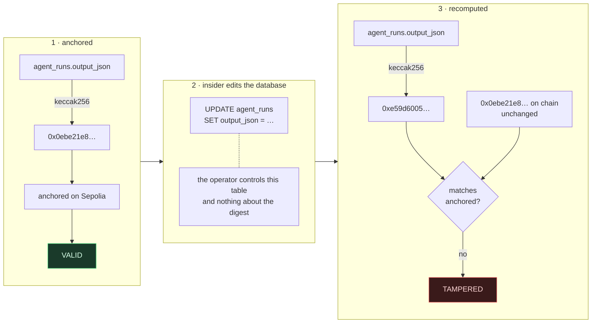
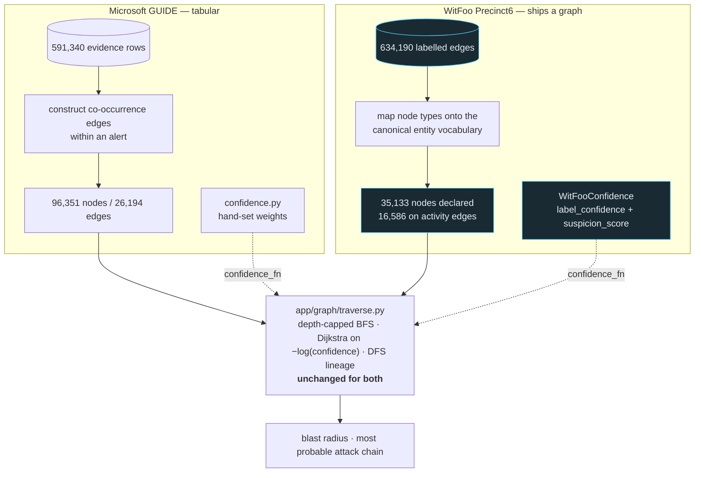

# AgentSphere SecureOps — architecture

Submission-quality diagrams. Mermaid renders on GitHub and in Devpost's markdown, and stays
editable, which a PNG does not.

## 1. System architecture

The load-bearing line in this diagram is the dashed one. Evidence, prompts and rationales stay
left of it; only digests, identities and approval state cross to the right. That split is what
lets the audit trail be tamper-evident without putting security data on a public chain.

```mermaid
flowchart TB
    subgraph data["Data layer"]
        guide[("Microsoft GUIDE<br/>5,000 incidents<br/>591,340 evidence rows")]
        prep["prepare_data.py<br/>sentinel masking, deterministic splits"]
        parquet[("Parquet<br/>evidence + incidents")]
        guide --> prep --> parquet
    end

    subgraph intel["Analysis"]
        baseline["LightGBM baseline<br/>non-LLM comparison point"]
        index["Hybrid retrieval<br/>BM25 + FAISS, fused by RRF k=60"]
        graph["Entity graph<br/>96,351 nodes / 26,194 edges"]
        parquet --> baseline
        parquet --> index
        parquet --> graph
    end

    subgraph agents["Agent workforce"]
        direction LR
        d["Detection"] --> c["Correlation"] --> i["Investigation"] --> t["Triage"] --> r["Remediation"] --> v["Verifier"]
    end

    subgraph control["Deterministic controls"]
        gate["Policy gate<br/>POL-001..006 — not an LLM"]
        human["Human approval<br/>required for medium/high risk"]
    end

    subgraph store["Application database (SQLite)"]
        db[("incidents · evidence · agent_runs<br/>decisions · approvals · proofs")]
    end

    subgraph chain["Public chain (Sepolia)"]
        registry["AgentRegistry<br/>who may submit"]
        proof["DecisionProof<br/>digests · approval · finalisation"]
        registry --- proof
    end

    ui["React + FastAPI<br/>queue · workflow · approval · proof"]

    baseline --> agents
    index --> agents
    graph --> agents
    agents --> gate --> human
    agents --> db
    gate --> db
    db -.->|"keccak256 digests only<br/>never evidence or prompts"| proof
    human --> proof
    db --> ui
    proof --> ui

    classDef chainStyle fill:#1a2332,stroke:#4a9eff,color:#e6edf3
    classDef controlStyle fill:#2a1f1a,stroke:#ff9e4a,color:#e6edf3
    class registry,proof chainStyle
    class gate,human controlStyle
```

## 2. End-to-end flow

Numbered to match §8.7 of the master plan. Steps 2–9 are deterministic algorithms; only 10 is a
model call, which is the answer to "is this just an LLM wrapper?".

```mermaid
sequenceDiagram
    autonumber
    participant A as Analyst
    participant Q as Risk queue
    participant G as Entity graph
    participant R as Retrieval
    participant W as Agent chain
    participant P as Policy gate
    participant C as DecisionProof

    A->>Q: open the queue
    Note over Q: max-heap over the normalised<br/>risk score; heapq.nlargest is O(n log k)
    Q-->>A: incidents, highest risk first
    A->>W: run the workflow on an incident

    W->>G: correlate alerts
    Note over G: Union-Find with path compression<br/>AND union by rank
    G-->>W: N alerts collapse into M clusters

    W->>R: find similar incidents
    Note over R: BM25 + vectors fused by RRF (k=60),<br/>then a metadata re-rank. Labels never cross.
    R-->>W: ranked precedents

    W->>G: blast radius + attack chain
    Note over G: depth-capped BFS that refuses to expand<br/>through hubs; Dijkstra on −log(confidence)
    G-->>W: impacted entities, most probable chain

    W->>W: Detection → Correlation → Investigation →<br/>Triage → Remediation → Verifier
    Note over W: strict JSON contracts; a failure degrades<br/>to a marked fallback, never a silent one

    W->>P: triage + recommendation + verdict
    Note over P: dictionary lookups and thresholds.<br/>An agent cannot argue past it.
    alt low risk, high confidence, verifier accepts
        P-->>W: auto-approved
    else anything else
        P-->>A: human approval required
        A->>C: approve (signature = msg.sender)
    end

    W->>C: submitDecision(incidentId, evidenceHash, outputHash, label, risk)
    Note over C: reverts unless the sender is a<br/>registered, active agent
    C-->>A: transaction hash

    A->>C: finalizeDecision
    alt medium/high risk with no approval
        C-->>A: revert ApprovalRequired
    else approved or low risk
        C-->>A: finalised
    end
```

## 3. The tamper-detection moment

Scene 5 of the demo. What makes it work is that verification *recomputes* the digests from stored
data rather than reading back a saved hash column — an earlier version did the latter, and would
have shown VALID after an edit.



## 4. Two graphs, one traversal layer

GUIDE is tabular, so its entity graph has to be **constructed** (§8.4). WitFoo Precinct6 **ships**
one. Both become the same `EntityGraph`, so the Day 4 traversal code runs on either without
modification — which is the cross-domain portability claim, demonstrated rather than asserted.

The difference that matters is where edge confidence comes from. On GUIDE it is hand-set and said
to be hand-set; on WitFoo the dataset supplies it for 33.8% of edges.



WitFoo's node total needs its parts shown, or 16,586 looks like data was dropped:

| | Count |
|---|---|
| Declared by the dataset | 35,133 |
| On activity edges — the traversal graph | 16,586 |
| Only on `INCIDENT_LINK` edges — incident membership, no observed activity | 16,503 |
| On no edge at all | 2,044 |

`INCIDENT_LINK` edges are excluded from traversal on purpose: they join an incident record to its
entities, so walking one would let a path hop between unrelated hosts through the incident node
and report that as an attack chain.

## 5. What is deliberately not on chain

| Stays in SQLite | Goes on chain |
|---|---|
| Raw evidence rows and entity values | `keccak256` digest of the evidence bundle |
| Agent prompts and full outputs | `keccak256` digest of the assembled outputs |
| Analyst comments | `keccak256` of the comment |
| Incident summaries, rationales | incident id, label, risk level |
| — | agent address, approver address, timestamps |

Enforced by what `DecisionProof` accepts: there is no function on that contract that could store
an evidence row even if a caller wanted to.
