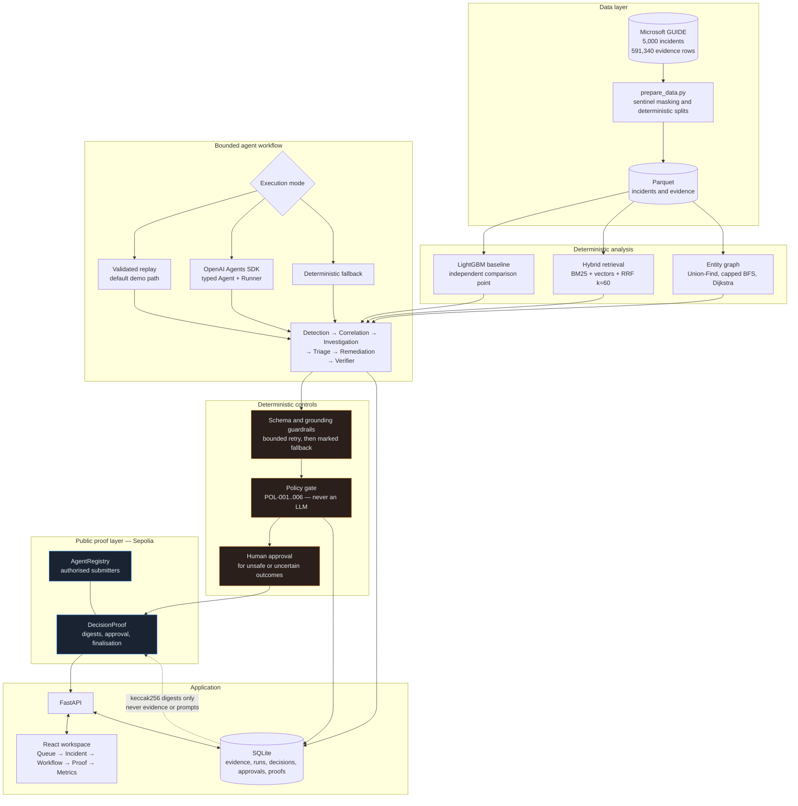
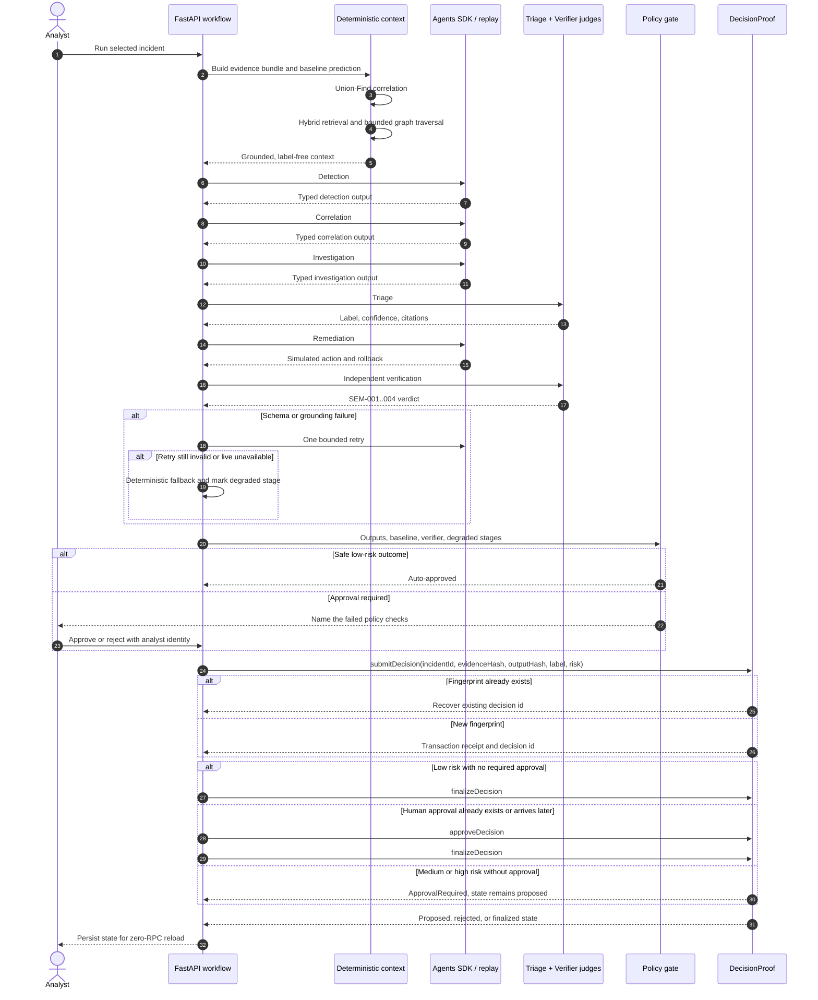
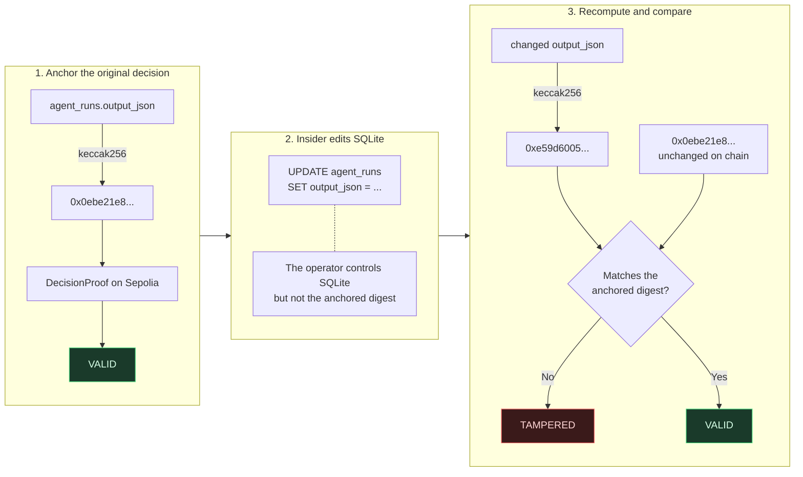
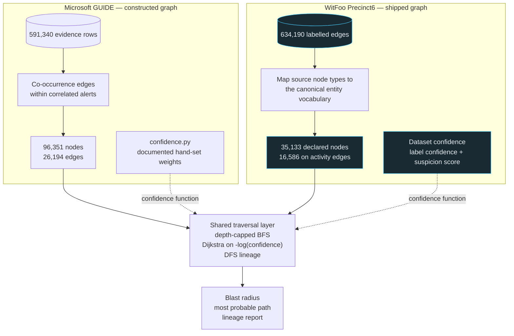
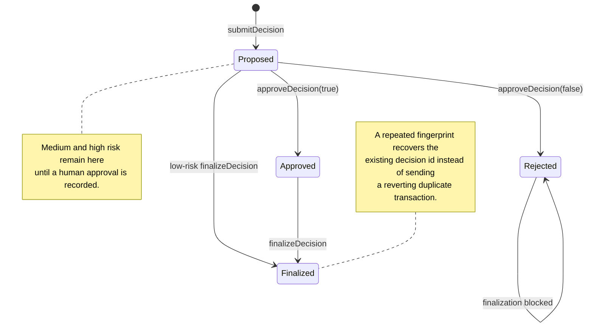

# AgentSphere SecureOps — architecture

These diagrams use Mermaid so they render on GitHub and remain editable. The central boundary is
simple: evidence, prompts, and rationales stay off chain; only digests, identities, and approval
state cross into the public proof layer.

## 1. System architecture

The six stages are deliberately orchestrated in a fixed order. The SDK does not receive an
unrestricted controller role, raw dataset labels, or write tools. Retrieval and graph tools are
read-only and bounded, and every model output must satisfy its Pydantic contract.

## 2. End-to-end decision flow

Replay is the default demonstration mode. A validated cache hit makes no OpenAI request; a cache
miss can run live only when explicitly configured. Every fallback is visible in `degraded_agents`
and forces human review.

## 3. Tamper detection

Verification recomputes both digests from the underlying evidence and agent-run rows. It never
trusts a saved “valid” flag or merely reads back the hash stored beside the decision.

The demo round trip is therefore observable and reversible:
`VALID → edit stored output → TAMPERED → restore original output → VALID`.

## 4. Two datasets, one traversal layer

GUIDE is tabular, so AgentSphere constructs an entity graph. WitFoo Precinct6 ships a graph. Both
are adapted to the same `EntityGraph` interface, allowing the capped BFS and confidence-weighted
Dijkstra implementations to run unchanged.

WitFoo’s node total needs its parts shown, or 16,586 looks like data was dropped:

| Node population | Count |
|---|---:|
| Declared by the dataset | 35,133 |
| On activity edges — the traversal graph | 16,586 |
| Only on `INCIDENT_LINK` edges — incident membership, no observed activity | 16,503 |
| On no edge at all | 2,044 |

`INCIDENT_LINK` edges are excluded from traversal intentionally. Traversing them would allow a path
to jump between otherwise unrelated entities through a shared incident record and misreport that
administrative membership as an attack path.

## 5. Proof lifecycle and idempotent recovery

Approval and anchoring may happen in either order. The API reconciles an approval recorded before
anchoring, persists the witnessed contract state, and keeps normal Proof-page reloads network-free.
The explicit **Confirm against the contract** action performs the live read and preserves that
response instead of overwriting it with the local-only view.

## 6. What is deliberately not on chain

| Stays in SQLite | Goes on chain |
|---|---|
| Raw evidence rows and entity values | `keccak256` digest of the evidence bundle |
| Agent prompts and full structured outputs | `keccak256` digest of the assembled outputs |
| Analyst comment text | `keccak256` digest of the comment |
| Incident summaries and rationales | Incident id, label, and risk level |
| Retrieval results and graph context | Agent address, approver address, and timestamps |

This boundary is enforced by the `DecisionProof` ABI: the contract has no function capable of
accepting a raw evidence row, prompt, rationale, or analyst comment.
